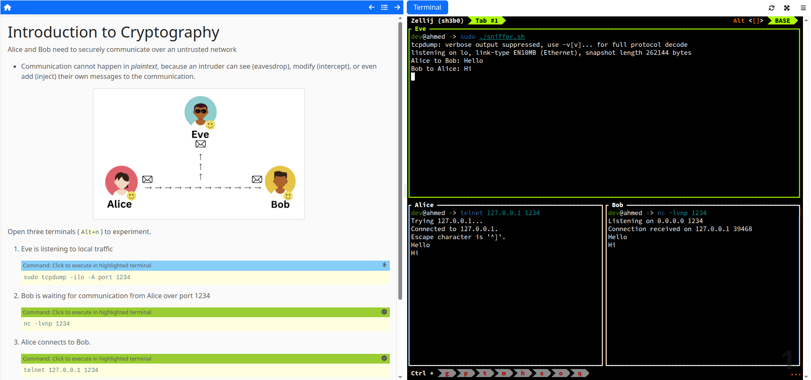

# interactive-labs

Complement your IT training workshops with a versatile practice environment.



## Quick Start (Docker)

1. Start from a given [docker-compose.yaml](./docker-compose.yaml)

1. Prepare a `workshop` directory with your lab content (refer to our [example](./workshop))

1. Run the lab with `docker compose up -d` and access at <http://localhost:3000>

## Quick Start (VM)

Follow the instructions in [vms](./vms) directory.

## Local Development

- With NPM

    ```bash
    cd labenv
    npm install
    npm run dev
    ```

- With Docker

    ```bash
    cd labenv

    docker build -t labenv:dev .

    docker run -d -p3000:3000 labenv:dev
    ```
