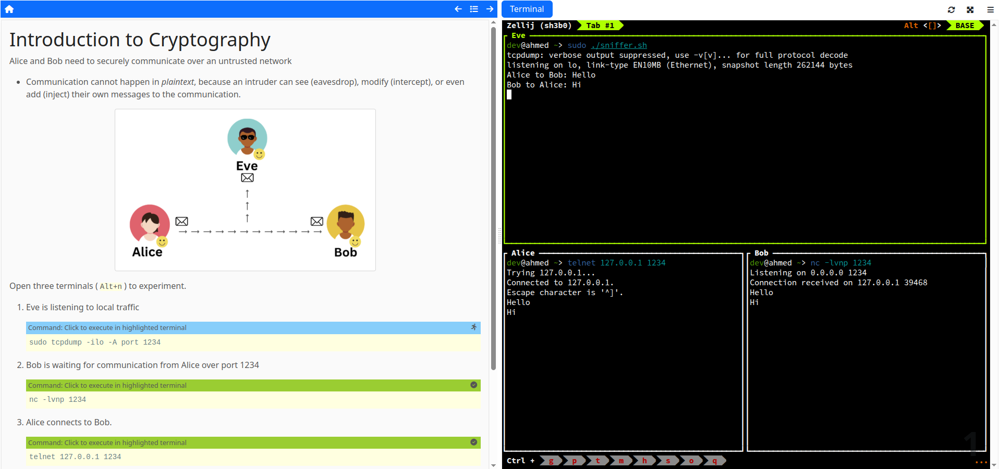

# interactive-labs

Transform your IT workshops into an interactive format using components from [educates.dev](https://educates.dev)



## Demo

1. Clone this repository
2. Run sample workshop with `docker compose up`
3. Access at <http://localhost:8080>

## Workshop Development in Docker

1. Create a directory of `*.md` files for your workshop (refer to [syntax reference](https://docs.educates.dev/en/stable/workshop-content/workshop-instructions.html) and our the [example](./example))
2. Update [docker-compose.yaml](./docker-compose.yaml) to bind-mount the directory to the renderer

    ```yaml
    renderer:
        ...
        volumes:
            - ./example:/opt/renderer/workshop/content
    ```

3. Customize [nginx.conf](./nginx.conf) or [zellij.kdl](./zellij.kdl) if needed.

4. Deploy the workshop. Changes to Markdown content are hot-reloaded.

    ```bash
    docker compose up
    ```

## Local Development

```bash
# Copy markdown directory to renderer
cp <workshop_dir> renderer/workshop/content

# Build renderer for this
cd renderer
npm i
npm run compile
npm run start

# Build Terminal
cd terminal
npm i
npm run compiler
npm run start

# Run Gateway
docker run --network host -v $(pwd)/nginx.conf:/etc/nginx/nginx.conf nginx:alpine
```
