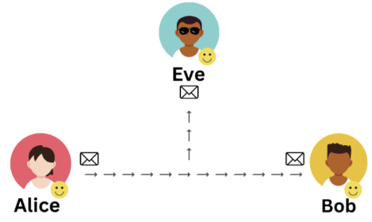

# Introduction to Cryptography

Alice and Bob need to securely communicate over an untrusted network

- Communication cannot happen in *plaintext*, because an intruder can see (eavesdrop), modify (intercept), or even add (inject) their own messages to the communication.

<p align="center"> </p>

Open three terminals ( `Alt+n` ) to experiment.

1. Eve is listening to local traffic

   ```terminal:execute
   command: sudo tcpdump -ilo -A port 1234
   prefix: Command
   title: Click to execute in highlighted terminal
   ```

2. Bob is waiting for communication from Alice over port 1234

   ```terminal:execute
   command: nc -lvnp 1234
   prefix: Command
   title: Click to execute in highlighted terminal
   ```

3. Alice connects to Bob.

   ```terminal:execute
   command: telnet 127.0.0.1 1234
   prefix: Command
   title: Click to execute in highlighted terminal
   ```

4. If Alice tries to send some message like `Hello`, the message would be seen in Eve's terminal. Can you spot it?

## Exercise 1

Write some BASH around the above `tcpdump` command to make it easier for Eve to see **only** the plaintext conversation (TCP Payload) between Alice and Bob.
